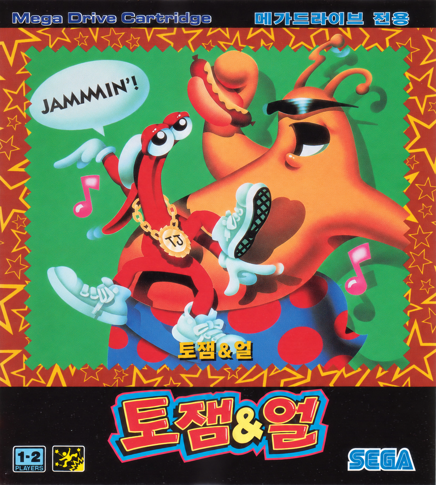

# 토잼 & 얼 한글화 (ToeJam & Earl Korean)

<p align="center">
  
</p>

**현재 버전: v0.4.1 (개발판)**

메가드라이브용 **ToeJam & Earl (U) REV00** 을 한글화하는 프로젝트입니다.
1991년 세가와 Johnson Voorsanger Productions가 만든 이 게임은 펑코트론 행성에서 온 두 외계인,
토잼과 얼이 추락한 지구에서 로켓선 부품 10개를 찾아 모으는 액션 게임입니다.

## 이름에 대하여

이 게임은 예전에 국내에 **「홀이와 뚱이」** 라는 이름으로 정식 발매되었습니다.
빨갛고 홀쭉한 토잼이 "홀이", 주황색에 몸집이 큰 얼이 "뚱이"였던 셈입니다.
그때를 기억하는 분들께는 정겨운 이름이지만, 이 한글화에서는 원문의 랩·펑크 분위기와
캐릭터 이름을 살리기 위해 **토잼 & 얼**로 옮겼습니다. 위 패키지 이미지에도 보이듯
토잼 & 얼 표기 역시 국내에 소개된 적이 있어 낯설지는 않을 겁니다.

## 버전과 진행도

v1.0을 "게임에 등장하는 모든 글자가 한글이고, 처음부터 끝까지 실제 플레이로 검증된 정식판"으로 잡았습니다.

| 버전 | 내용 | 상태 |
|------|------|------|
| v0.1 | 텍스트 엔진 교체(16x16 한글 렌더러, 3개 출력 경로), 문자열 추출·인코딩·빌드 도구 | 완료 |
| v0.2 | 대사·인트로·메뉴·아이템·크레딧 등 문자열 299개 1차 번역, 에뮬레이터 자동 검증 | 완료 |
| v0.3 | 한글 폰트 Galmuri14로 교체(ㅏ 획 누락 수정), HUD 8x8 한글 시도 후 원본으로 복귀. v0.3.1: 원작 느낌의 굵은 글자·삐뚤한 줄, 메뉴 텍스트에 원작 노란색 팔레트 적용 | 완료 |
| **v0.4** | HUD(등급, 휴가 중, 선물 목록 이름) 8x8 한글화 재활성화. 글리프 타일을 게임의 스테이징 버퍼·VBlank DMA 큐로 올려 화면 갱신 중 VRAM 주소를 건드리지 않게 함. 8x8 글자에도 원작 팔레트와 어긋난 줄 적용. v0.4.1: 그림으로 저장된 HUD 라벨("toEJaM iS A"→"토잼 등급", "EaRL iS"→"얼은")을 새 한글 타일로 교체 | 현재 |
| v0.5 | 실기·에뮬레이터 전체 플레이 검증, 말풍선·레벨 메시지·게임 오버 확인, 번역 다듬기 | 예정 |
| v0.6 | 남은 그림 문자 교체: 실행 중에 조립되는 "BUCKS"·"POINTS" 글자, 픽셀 행 단위로 애니메이션되는 "OPEN" 타이틀, 지도 화면 "SHIP PIECE HERE" | 예정 |
| v0.7 | 타이틀 화면 한글 표기 검토 | 예정 |
| v1.0 | 전 구간 검증 완료 정식판 | 예정 |

### 지금 한글로 나오는 것

| 항목 | 상태 |
|------|------|
| 인트로 스토리 | 한글 |
| 캐릭터 대사(말풍선) | 한글 (실기 확인 필요) |
| 메뉴, 사운드 테스트, 옵션 | 한글 |
| 로켓 부품 이름, 레벨 시작 메시지, 게임 오버 | 한글 (레벨 메시지·게임 오버는 실기 확인 필요) |
| 크레딧 | 한글 (사람 이름은 원문) |
| 하단 HUD(등급, 휴가 중), 선물 목록 이름 | 한글 (8x8 폰트, 실기 확인 필요) |
| HUD 라벨 "토잼 등급", "얼은" (그림 타일) | 한글 (8x8) |
| "BUCKS", "POINTS", "OPEN", "SHIP PIECE HERE" 그림 문자 | 미착수 (그래픽은 비압축이라 위치는 파악됨) |
| 타이틀 로고 | 미착수 |

### HUD 8x8 한글에 대하여

하단 HUD는 8픽셀 3줄짜리 패널이어서 16픽셀 한글이 들어가지 않습니다. 이 영역은 Galmuri7 기반 8x8 한글을
한 줄로 출력합니다. v0.3에서 실제 플레이 중 그래픽 깨짐이 보고되어 한 번 끈 적이 있는데, 당시에는 글리프
타일을 화면 갱신 도중 VRAM에 직접 써서 VDP 쓰기 주소를 되돌려야 했고, 그 추적이 어긋나면 엉뚱한 곳에
타일이 찍힐 수 있는 구조였습니다. v0.4부터는 게임이 스프라이트 그래픽에 쓰는 스테이징 버퍼와 VBlank DMA 큐로
올리므로 이 의존이 없습니다. 다시 깨짐이 보이면 어느 장면인지 알려 주세요. `tools/tje/build.py`의
`HUD_KOREAN`을 `False`로 두면 원본 영어 HUD로 빌드됩니다.

## 기술 개요

- 게임 텍스트는 세 가지 경로로 출력됩니다. 스프라이트 스트립(인트로, 아이템), 말풍선(대사),
  배경 플레인(메뉴, HUD, 메시지). 세 경로의 글리프 렌더러를 모두 새 68000 코드로 교체했습니다
  (`tools/tje/asm/text.s`, ROM 확장 영역 0x100000에 배치).
- 한글은 16x16(Galmuri14), 영문은 8x16(Galmuri11) 글리프입니다.
  [Galmuri](https://github.com/quiple/galmuri)(SIL OFL) 폰트 획을 2px로 굵히고 글자마다 위아래로 1px씩
  어긋나게 해 원작의 손글씨 느낌을 냈습니다. 스프라이트 텍스트는 검은 글자·흰 외곽선, 메뉴·메시지는
  원작 메뉴 폰트의 노란 글자·갈색 그림자·검은 상자 팔레트를 씁니다.
- 한글 한 글자는 2바이트 코드(리드 `0x80|hi`, 트레일 `1..255`)로 저장되며, 번역에 실제로 쓰인
  음절만 글리프 테이블에 들어갑니다.
- 게임 그래픽은 `[타일 수][4bpp 타일…]` 형식의 비압축 에셋입니다. 그림으로 들어간 글자는
  `tools/tje/labels.py`에 (에셋, 타일 번호, 한글, 팔레트)로 정의해 새 타일로 덮어씁니다.
- ROM은 1MB에서 2MB로 확장되고 헤더 체크섬을 다시 계산합니다.

## 빌드

원본 ROM은 저작권 문제로 저장소에 포함하지 않습니다. 직접 소유한 카트리지에서 추출한
`Toejam & Earl (U) (REV00) [!].gen`(MD5 `0a6af20d9c5b3ec4e23c683f083b92cd`)을 저장소 루트에 두세요.
`.gitignore`가 `*.gen` 파일을 막고 있어 실수로 올라가지 않습니다.

```bash
python3 -m venv venv && venv/bin/pip install capstone pytest   # Pillow는 시스템 패키지 사용
# m68k 어셈블러: apt install binutils-m68k-linux-gnu (또는 .deb를 받아 dpkg -x 로 풀어 M68K_BIN 지정)
venv/bin/python -m tools.tje.build        # -> build/tje_ko.gen
venv/bin/python -m pytest tests
```

## 번역 수정

`translations/strings.csv`의 `ko` 열을 고치고 다시 빌드하면 반영됩니다.

- 말풍선 대사: 최대 12열(한글 6자)
- 선물 이름: 최대 13열
- 그 외: 최대 32열(한글 16자)
- 한글은 2열, 영문·숫자·기호는 1열로 계산합니다. 초과하면 빌드가 실패하며 해당 줄을 알려줍니다.

## 검증

`tools/emu/harness.py`는 Genesis Plus GX libretro 코어를 파이썬에서 직접 구동해 헤드리스로
스크린샷·RAM·VRAM 상태를 뽑습니다. 코어 파일 `tools/emu/genesis_plus_gx_libretro.so`는
[libretro buildbot](https://buildbot.libretro.com/nightly/linux/x86_64/latest/)에서 받아 넣으세요.

```bash
venv/bin/python tools/emu/harness.py build/tje_ko.gen --frames 1800 --press 900:start --shot 1800:intro.png
```

직접 플레이해 볼 때는 [BlastEm](https://www.retrodev.com/blastem/) 같은 에뮬레이터에 `build/tje_ko.gen`을 넣으면 됩니다.

## 라이선스

이 저장소의 도구와 번역 텍스트는 자유롭게 사용할 수 있습니다. 게임 자체의 저작권은 세가에 있으며,
ROM 파일은 배포하지 않습니다. Galmuri 폰트는 SIL Open Font License를 따릅니다
(`tools/tje/fonts/LICENSE.txt`).
